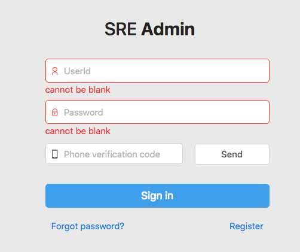

# 前言

本文是对我自己及团队成员工作上的一些指导或要求，欢迎补充和改进。

总结来说就是： **Be Professional!**

# 必读书籍资料

## 短期

**这些是进入项目就要用到的，请务快速必掌握。**

- [Pro Git](https://git-scm.com/book/zh/v2)，如果以前对 Git 不熟悉，需要先把这本书前三章读一遍，此外搞清楚 [merge 和 rebase](http://mislav.uniqpath.com/2013/02/merge-vs-rebase/)。
- [How to Name Things](http://slides.com/inetfuture/how-to-name-things)
- [RESTful API](restful_api.md)
- [Markdown](markdown/README.md)

## 长期

- 《代码整洁之道》
- 《重构：改善既有代码的设计》
- 《敏捷软件开发：原则、模式与实践》
- 《企业应用架构模式》
- 《深入理解计算机系统》
- 《TCP/IP 详解 卷1》
- 《Linux 内核设计与实现》
- 《搞定：无压工作的艺术》

# 必备工具

## 科学上网

方式很多，建议购买国外 VPS 自建 shadowsocks，~~服务端推荐使用[搬瓦工](https://bwh88.net/aff.php?aff=48579)~~（已经不稳定，经常被封 IP），客户端 macOS 使用 [ShadowsocksX-NG](https://github.com/shadowsocks/ShadowsocksX-NG)，Ubuntu 使用 [shadowsocks-qt5](https://github.com/shadowsocks/) 配合 [Chrome Proxy SwitchyOmega](https://chrome.google.com/webstore/detail/proxy-switchyomega/padekgcemlokbadohgkifijomclgjgif?hl=en) 插件，具体搭建方式自己搜。或者买服务，注意经常有跑路的，一次不要买太长。

## 编辑器

[Sublime Text](http://www.sublimetext.com/3)，安装 [Package Control](https://packagecontrol.io/installation)，必备插件：Git、GitGutter、knockdown、SublimeLinter、DocBlockr、EditorConfig、Emmet、FileDiffs、SublimeCodeIntel、SidebarEnhancements。

可以将整个配置目录放到 GitHub 上，方便在多台机器上同步，比如 [inetfuture/sublime-config](https://github.com/inetfuture/sublime-config)，配置目录的位置：

- Linux：`~/.config/sublime-text-3/Packages/User`
- macOS：`~/Library/Application\ Support/Sublime\ Text\ 3/Packages/User`

或者使用 [VS Code](https://code.visualstudio.com/)。

配合 [editorconfig](http://editorconfig.org/)，使用时需下载建议的[配置文件](.editorconfig) 到源码根目录，并安装编辑器相应插件。

## 知识管理

[印象笔记](https://www.yinxiang.com/)，不建议使用 Evernote 国际版，太卡，而且国内的版本提供的本地化服务更方便。

- [Chrome 剪藏插件](https://appcenter.yinxiang.com/app/evernote-webclipper/web-apps/)
- 关注微信公众号：“我的印象笔记”，可以快速收藏微信公众号文章。

## TODO 管理

[Trello](https://trello.com) 或 [Teambition](https://www.teambition.com/)。

## Chrome 插件

- [Smart TOC](https://chrome.google.com/webstore/detail/lifgeihcfpkmmlfjbailfpfhbahhibba)
- [Octotree](https://www.octotree.io/)
- [Onetab](https://chrome.google.com/webstore/detail/onetab/chphlpgkkbolifaimnlloiipkdnihall?utm_source=chrome-ntp-icon)
- [Awesome Screenshot](https://chrome.google.com/webstore/detail/awesome-screenshot-screen/nlipoenfbbikpbjkfpfillcgkoblgpmj?utm_source=chrome-ntp-icon)
- [Stylish](https://userstyles.org/)
- [Tampermonkey](https://chrome.google.com/webstore/detail/dhdgffkkebhmkfjojejmpbldmpobfkfo)

## 其它

- [Oh My Zsh](https://github.com/robbyrussell/oh-my-zsh)
- [DevDocs](http://devdocs.io/)
- [有道词典](http://dict.youdao.com/)

# 开发环境配置

## 安装软件

- 优先使用语言版本管理器安装语言运行时，比如 nvm（Node.js）、pyenv（Python）、rvm（Ruby）、jenv（Java）、phpbrew（PHP）、gvm（Golang）。

    **注意，此类工具通常安装在你的 `$HOME` 下，通过修改当前 shell 的 `$PATH` 等环境变量生效，就是说安装或者使用它们的时候，你不需要也不应该使用 `sudo`。**

    好处：

    - 不需要 `sudo`，不会污染系统环境，如果某天坏掉了，可以直接删掉重来。
    - 方便版本切换，及时用上最新版本。

- 优先使用语言包管理器安装语言依赖，比如 npm（Node.js）、pip（Python）、gem（Ruby）、maven/gradle（Java）、pecl/composer（PHP）。
- 优先使用系统包管理器安装系统依赖，比如 apt-get（Ubuntu）、homebrew（macOS）。
    - 对于一些第三方工具，优先使用其官方源或者可靠的 PPA 源。
- Ubuntu 必备软件包：`sudo apt-get install -y aptitude gdebi vim curl wget build-essential openssh-server`。

# 做事原则与方法

- 主动沟通而不是被动应付：
    - 工作上存在任何让你不爽的事时，尽量提出来，所有的问题都可以讨论、协调、缓解，甚至完全避免，长期压抑着会影响自己的工作效率和积极性，对个人和团队都不利。

        举个例子，之前参与的一个项目，使用的技术栈过于复杂，同时使用了 PHP、Python、Node.js，导致开发效率低，维护也很麻烦，我很不爽，还好老大比较开明，经过沟通后，决定全部替换为 Node.js，从此我就再也不用纠结这个事情。

    - 对需求、开发规范、代码组织等等各方面存在任何疑问时，主动询问和讨论，不要默不作声、自作主张导致返工和延误。
    - 自己的代码被别人 Review 时，如果觉得某段代码可能有问题或者不是最优方案，主动提出来讨论，而不是等待审查者询问。前者可以使 Review 更高效，更利于培养同事间的相互信任，后者一是效率低，同时也是一种不负责任的表现。
    - 进度存在风险时主动知会其他人，而不是默默拖到最后一刻连累大家加班。
    - 做变更时及时通知相关人员，否则可能会浪费队友的时间去排查问题。代码级别的问题可以通过在 GitLab 等代码管理工具上 at 对方。
- 认真负责，关注细节，追求卓越：
    - 每一份需求都要理解之后再动手，感觉需求不合理或不明确的要提出来讨论，对产品要有责任心，不仅仅是“按部就班”得做事情。
    - 提交前仔细测试自己实现的功能，检查代码细节，有交付高质量代码的责任心，而不是依赖其他成员帮你 Reivew 或者 QA 帮你发现 bug。
    - 代码仅仅可以工作是不够的，还要可读、易扩展、可维护、安全、高效，等等等等，要用高标准要求自己，写代码要“上心”，认真写好每一行，不要敷衍、随意。
    - 细节不一定决定成败但却可以充分体现一个人的工作态度，请认真对待各种流程、规范，比如写英文邮件时，从语法、格式到每一个拼写、标点，再比如 Commit Message 的格式、Coding Style 等等。
- 自我驱动：
    - 自觉深入学习相关技术，而不是用多少学多少，临时抱佛脚。比如使用 Spring 框架，不要只是满足于能完成功能，应该自觉学习其原理和思想，依赖注入、面向切面都是怎么工作的？spring-boot 自动做了哪些事情？这样一方面当遇到框架问题时，你就能从容应对，另一方面这些知识将对你有潜移默化的帮助，总能用得到。
    - 自己给自己提问题，并解决问题。比如让你去搭一个分布式存储系统，能跑起来只是最简单、最基本的要求，你应该能给自己提这些问题：怎么冗余容错？怎么备份、恢复？怎么监控容量并报警？怎么手动、自动扩容？业务如何方便的使用？是否需要制定使用规范？
    - 主动思考产品的走向，自觉进行知识储备、调研。
    - 自觉重构低质量代码，改善项目流程，等等，保证项目的健康发展。
- 换位思考：
    - 使用邮件、微信等工具交流时一次性提供必要的上下文，避免低效率的沟通，想一下，我这样描述对方是否可以理解并直接回复。
    - 无论是做 Code Review 还是提交功能给 QA 测试，尽自己最大努力保证质量，做好自己分内的事，减轻队友的负担。
    - 作为开发，想一下我该怎样为 leader 分担压力？作为 leader，想一下我该怎样促进下属工作能力的稳步成长？
- 从根本上解决问题：
    - 思考问题的原因，不要停留于表面问题的修修补补。

        比如，QA 报了一个 Bug，说在一个输入项中填入 `<script>alert('haha');</script>`，保存后页面上会弹出提示框，你来修复这个问题的时候要考虑从根本上杜绝脚本注入问题，比如使用 Angular.js 的 `$sanitize` service 过滤输入再显示。相比较而言，不太恰当的做法是仅仅用正则过滤掉输入中的 `<script />` 标签，虽然可以修复这个 Bug，却是治标不治本，如果输入中包含 `onmouseover="alert('haha')"` 这种代码呢？

        当然这种问题需要你有扎实的基本功，对开发各个方面有较全面的了解，才能一针见血的解决问题。

    - 每一个问题，想一下有没有办法一劳永逸？或者自动化？
    - 谁痛苦，谁改变。某件事总是让你很不爽？想办法改变它！
- 用正确的方式解决问题：
    - 很多问题都有不止一种的解决办法，不要满足于你最初想到的那种，也许有更好的呢？主动去思考目前的方案可维护吗？方便吗？效率高吗？普适吗？
    - 多看一些最佳实践（Best Practice）的资料，多看一些优秀开源项目的源代码，多了解别人怎么做的你才能及时发现自己的不足。

        比如 RESTful API，是有一套业界公认的最佳实践的，其本身就是一套约定俗成的东西，如果你没有看过这些最佳实践，随意的设计 URL，随意的使用 HTTP 动词，那你设计出来的 API 其实只是 HTTP API，请不要称其为 RESTful API。

        再比如你对 Git 不熟，然后不知怎么得把工作目录搞的一团糟，你该怎么办？再 clone 一个重新开始？NO！除非你打算一辈子这么干。你应该去 google 解决方案，并充分认识到自己对 Git 不熟这个事实，然后拿出时间来补充知识。

    - 不要重复造轮子，尤其是使用第三方库时，也许人家已经提供了现成的解决方案，只是因为你没有仔细看文档，所以不知道。当然，如果你只是想锻炼自己的能力，重复造轮子是很有效的方式，但请对项目负责，不要擅自在项目里做。
- 磨刀不误砍柴工：
    - 学习新知识要尽可能的系统、全面，不要只是为了应付当前工作片面了解。
    - 使用第三方库、框架时应尽量通读其文档，至少要知道它可以做什么，有哪些限制，遇到具体问题后可以迅速到文档中查看细节。
    - 常用的技术点要舍得花时间搞清楚其运行原理、内部机制，免的每次出问题都像无头苍蝇，只能瞎猜。比如 Angular.js 的 directive 编译流程是怎样的？Node.js 的异步 IO 是如何运行的？
    - 工欲善其事，必先利其器。平时要注意效率工具的积累，包括好的代码编辑器、命令行工具、任务管理工具、各种实用小工具等等。对于你常用的编辑器或 IDE 应该花一些时间去熟练它的快捷键，寻找一些好用的插件，毕竟工作每天都要用，投入的精力绝对物超所值。

# 编写整洁代码

> Writing clean code requires the disciplined use of a myriad little techniques applied through a painstakingly acquired sense of "cleanliness". This "code-sense" is the key. Some of us are born with it. Some of us have to fight to acquire it. Not only does it let us see whether code is good or bad, but it also shows us the strategy for applying our discipline to transform bad code into clean code.

## 基本要求

- 要有敬畏心，认真对待你的每一行代码、注释、文档，做不到的请转行，不要来恶心队友。
- Coding Style，如果有要求，应该严格遵循，任何例外的情况需要讨论决定。
- 可读性，要容易理解，命名要具有足够描述性，不能有歧义，代码路径、结构要清晰、简洁。
- 一致性，包括但不限于标识符命名、错误处理、日志格式、文件组织方式、HTTP API 接口设计、UI 交互等各个方面，越是一致的系统越容易上手，越容易维护，反之则维护成本越高。
- 健壮性，进行必要的输入验证（不要过度处理），充分得考虑边界情况，异常处理要周全，防止内存泄露，防止竞态条件，多线程安全，等等。
- 性能，考虑数据量大或者访问频繁时的情况，对内存、数据库的使用要高效，算法要尽量最优。
    - 任何涉及数量的地方，在业务场景合理的前提下考虑把数量放大到最大，为最坏的情况做打算。
    - 数据库：
        - 操作应尽量批量进行，只查询必需的字段，减少 IO 消耗。
        - 特别大的查询应在数据库中分页，由程序控制分批次处理，全量取出在内存中计算或者根本不考虑数据量大小是常见的低级错误。
        - 合理使用索引。
    - 基本优化思路：
        - 预先筛选数据，减少不必要的计算。
        - 缓存计算结果，减少重复计算。
        - 使用高效数据结构，空间换时间。
- 安全性，进行必要的权限检查，不能过度信任客户端输入。
- DRY（Don't Repeat Yourself）原则，复制、粘贴的行为是要坚决禁止的，不知道如何复用代码的要主动与其他成员讨论。
- 单一职责原则，一个类、文件或者模块不能做的太多，不能做不该它做的事，好的设计是只把一件事做好。
- 封装原则，不要暴露不必要的实现细节。
- 开放、封闭原则，要方便扩展，要考虑到以后的需求。
- 代码改动方式要合适，不能一味得堆砌代码，需要适时停下来进行重构。
- 保持干净，不能存在任何无用的文件、代码，所有注释、文档需要同步更新，不能包含注释掉的代码，不能包含临时调试代码，例外情况应该添加注释说明。尤其注意借鉴代码片段时，复制过来要 refine，确保每一行都符合本项目规范，每一行都适用于本项目，并且每一行你都读得懂，不懂的搞清楚才能提交。
- 所有 Warning 都应该被立即修复，觉得不需要修的，讨论决定后通过修改配置文件禁用掉。

## 进阶要求

- [使用多态减少或转移 if 判断](https://www.youtube.com/watch?v=4F72VULWFvc&index=1&list=PL693EFD059797C21E)

## 提高代码可读性的技巧

- [How to Name Things](http://slides.com/inetfuture/how-to-name-things)
- [Clean Functions](https://slides.com/inetfuture/clean-functions)
- [Patterns to Avoid Code Duplications](https://slides.com/inetfuture/patterns-to-avoid-code-duplications)
- 局部变量尽量就近声明。
- Return early：[Try Not to Use Else](https://www.airpair.com/php/posts/best-practices-for-modern-php-development#4-2-try-not-to-use-else-)、[How and Why to Avoid Excessive Nesting](http://www.codeproject.com/Articles/626403/How-and-Why-to-Avoid-Excessive-Nesting)
- 在语言本身语法允许的情况下，将主流程放在文件上部，子流程按被调用顺序放在文件下部，这样打开文件后可以比较快的抓住重点，例如：

    ```js
    const main = () => {
      doStuff1();
      doStuff2();
      doStuff3();
    };

    const doStuff1 = () => {
      console.log('1');
    };

    const doStuff2 = () => {
      console.log('2');
    };

    const doStuff3 = () => {
      console.log('3');
    };
    ```

- 代码应按使用顺序、主次顺序、先后顺序、相关性组织，即要有一定的排序逻辑，尤其是添加新代码时，不要一味得添加到文件尾部。
- 布尔变量命名应尽量采用肯定形式。
- 避免硬编码数字、字符串，应使用常量并给它们有意义的名字。
- 传递简单数据类型时，适当添加临时变量提高可读性，例如：

    ```js
    const ignoreError = true;
    doStuff(ignoreError);
    ```

- 使用直接表明你意图的写法，而不是绕弯子，例如：

    ```js
    // 反例：使用计数表示是否
    let deletedItemsCount = 0;
    for (const item of list) {
      if (item.isDeleted) {
        deletedItemsCount++;
        doStuff1();
      }
    }
    if (deletedItemsCount > 0) {
      doStuff2();
    }

    // 正例：使用布尔表示是否
    let hasDeletedItems = false;
    for (const item of list) {
      if (item.isDeleted) {
        hasDeletedItems = true;
        doStuff1();
      }
    }
    if (hasDeletedItems) {
      doStuff2();
    }
    ```

- 拼接字符串时，使用插值而不是 `+` 操作，例如：

    ```js
    // ES6
    const name = 'Aaron Wang';
    console.log(`Hi, ${name}`);
    ```

    ```java
    // Java
    String name = "Aaron Wang";
    System.out.println(String.format("Hi, %s", name));
    ```

## 如何写注释

- 代码的意图应该由代码自身来表达，即所谓的可读性，尽量不要依赖于注释说明，所以优先考虑写更可读的代码。
- 代码意图明显的情况下，不要加注释重复说明。
- 以下注释是合理的或者说以下情况需要写注释：
    - 纲要性的注释，简要的描述某一个文件、某一个类、某一个方法或某一个流程，尤其是存在项目规范时，比如所有 public 类、方法要写注释以方便生成 API 文档。
    - 确实无法从代码本身提高可读性的情况，比如复杂业务逻辑、算法。
    - 代码的作用并不直观（各种 hack）时，解释这样做的原因。
    - 存在多种可选方案时，解释为什么选择现在这种，其它方案有何问题。
    - 因为某些限制而使代码不一致、不优雅或存在副作用时，应注明原因及后果。
    - 参考了外部一些资料时，应注明链接，方便其他人查看。
    - 临时标记注释：TODO、FIXME、HACK、OPTIMIZE、REVIEW 等。
- 注释应随代码更新，为了避免不同步，注释里不要包含不必要的细节，比如：

    ```js
    // 每 3 秒 xxx
    setInterval(3000, doStuff);
    ```

    这里的“每 3 秒”换成“定时”更容易维护，其既不影响理解，也不会出现修改 interval 忘了改注释的情况（否则很容易出现）。

## 如何写日志

写日志的方法应该命名为相应的 level，比如 `debug`、`info` 等，并接受四个参数：

- `message` *(String)* ：日志消息，应为固定字符串，中间不要拼接任何变量（变量应该放到 `context` 里）。使用英文时应注意时态且首字母应大写（代码标识符例外，应保持原样），句号可加可不加，保持一致即可：

    ```js
    // 描述接下来要做什么或正在做什么，应该用现在进行时
    logger.info('Sending emails');
    sendEmails();
    // 描述什么事情做完了，应该用一般过去时，并且没必要加 successfully 等字眼，不是 failed 自然就是成功
    logger.info('Emails sent')
    // 描述失败的情况：
    logger.info('Failed to send emails') // 或者，Sending emails failed，注意是动名词做主语，不是 Send emails failed
    ```

- `context` *(Map, optional)* ：可选，日志上下文，以 kv 形式存放日志产生时的一些关键变量等。
- `error` *(Error, optional)* ：可选，错误或异常对象。
- `requestId` *(String, optional)* ：可选，请求 ID，用于调用链追踪。

### 日志级别

- `debug` 级别可用于记录代码执行细节信息，应该仅用于本地开发环境，或者完全不用。
- `info` 级别可用于记录代码运行主干流程，比如记录 HTTP server 启动成功。
- `warning` 级别可用于记录预期内的、但比较重要或需要留意的信息，出现后不要求立即采取措施，比如记录危险的删除操作、无效的请求（HTTP 4xx）等。
- `error` 级别的应该用于所有非预期错误，出现时要求立即采取措施，要么修复，要么密切观察是否为偶发，要么调低级别，比如调用关键第三方服务失败、未捕获的异常等。
- 建议本地开发环境开启 `debug` 级别，staging 和 production 环境开启 `info` 级别。

### 补充说明

- 正确使用日志级别，尤其不要滥用 `error`，否则会淹没关键信息，干扰系统调试。经常出现但无需干预的，都不应该是 `error`，`error` 意味着需要干预，一个健康的系统里，其数量应该非常有限。
数量。
- `message` 应为固定字符串，不要在其中拼接变量，变量应该放到 `context` 里，如此才能方便对 `message` 做统计、分析、报警。需详略得当：
    - 对于细节、流程日志，除了陈述事实，最好说明影响、逻辑后续的走向，比如 `Skipped xxx due to xxx limit` 要比 `Reached xxx limit` 对调试、理解代码执行路径更有帮助。
    - 对于错误、异常，尽量说出问题的本质，比如不要仅是说什么操作失败了，要说为什么失败，DNS 解析超时、连接超时还是响应错误，或者携带相应的 `context`、`error`。
- 应提供尽量完整的 `context`，比如 HTTP 请求响应的参数、关键变量等，对于较复杂的 `context` 应只在入口处打一次再配合 `requestId` 实现调用链路追踪以避免给日志收集、处理系统造成过大压力。
- 不要过度打日志以避免给日志收集、处理系统造成过大压力。

## 如何处理异常（错误）

- 不要吞掉异常（错误）：若明确知道某异常（错误）大概率发生（不要多虑）且可忽略，此时方可 catch 并加注释说明，否则不要 catch 了但不处理、不返回、不抛出。
- 不要过度处理异常（错误）：一般用面向切面的方式统一捕获未处理异常（错误），统一记录日志，统一组装给客户端的响应。在此前提下，不要捕获、处理你无法处理、无法恢复的异常（错误），不要额外记录日志（除非可以比统一处理的提供更多上下文信息）。
- 保留原始异常（错误）：比如 Java 中 `throw new RuntimeException()` 用第二个参数把原始 exception 传进去，如此在 stacktrace 里会有 `caused by` 信息。
- 若要重试，必须加次数限制，应做好统一封装。

### 错误反馈设计

- 服务端：
    - 遵循框架、协议的最佳实践，gRPC 就应该用 gRPC 的 [code](https://github.com/grpc/grpc-go/blob/master/codes/codes.go)，HTTP 就应该用 HTTP status code（后面是 gRPC 服务的话意味着 gateway 要做转换）。
    - 错误，尤其验证错误，需尽量一次性把可能的都找出来并集中返回，而不是每次只返回一个（对客户端或用户会不友好，集成阶段或用户使用时可能需要多次试错），这意味着最终给客户端的 errors 需要是个集合（建议用 map，出错的请求字段做 key）。
    - 避免使用数字 error code，因为可读性差，得查文档，维护也麻烦，如果实在需要，可使用字符串 code，并尽量复用（不要在里面放字段名），比如 canNotBeBlank、invalidFormat、tooLong、tooShort、tooBig、tooSmall、alreadyExists 等。国际化可按 code 翻译 message，简单场景下英文甚至可以直接从 code 拆出来用。
    - message 也要尽量复用，不要带字段名，比如使用“can not be blank”，而不是"xxx can not be blank"。对于代码，哪个字段的问题可从 errors 的 key 得出，对于用户，界面上要把该错误消息跟其 input 对应，也不存在歧义。
- 前端：
    - 通用处理，比如对于输入表单，做到只需把服务端返回的 errors 直接挂到整个表单上，即可自动根据 key（即字段名）关联对应的 input，并将错误显示到 input 下。比如：

        

最终 RESTful API 返回的结构建议如下：

```
{
  message: '',
  errors: {
    field1: {
      code: 'invalidFormat',
      message: '无效格式'
    },
    field2: {
      code: 'alreadyExists',
      message: '已存在'
    }
  }
}
```

说明：

- `message`：整体错误消息，一般跟 HTTP status code 对应，比如 400 就是“Bad request”。另外某些场景下，错误不是跟具体某个请求字段对应的，此时也可以直接放 `message` 里，比如某个 API 可能报“memberId, clientId and openId can not be all empty”，这个错就不是一个字段的问题，在 errors 里不好表示。
- `errors`：可选，key 为错误字段，value 为错误的 code 和 message。其实再完善一点，value 应该是个数组，因为一个字段可能有多个验证规则，则可能同时有多个错误，鉴于这种场景较少，可以不考虑。

# Code Review

## 目的

- 提高代码质量，查漏补缺。
- 相互学习。
- 促进项目内知识流动，防止对某个个人过分依赖。

## Commit Message 规范

规定格式如下：

```
$(scope): $(subject)

$(description)
```

- `$(scope)`：必需，取决于具体项目，一般为项目目录、模块或组件的名字，用来描述本次 commit **影响的范围**（即 where），比如 [Node.js](https://github.com/nodejs/node/commits/master) 和 [Golang](https://github.com/golang/go/commits/master) 的源码仓库。嵌套层级结构可以用 `/` 表示，如 `net/http`。涉及多个目录、模块或组件可以用 `,` 隔开（不加空格以节省空间），如 `net/http,cmd`、`net/{tcp,http}`（表示 `net/tcp` 和 `net/http`）。后加入项目的新成员应遵循已有的 scope 约定（通过 `git log` 可以查看某个文件的提交历史），不要自己编造。使用首字母小写的驼峰命名。`bug`、`hotfix`、`task`、`change`、`refactor` 等等描述的都不是影响的具体范围，而是改动类型，不能用作 scope。除具体的目录、模块或组件名之外，可以使用 `base` 表示基础结构、框架相关的改动，用 `misc` 表示杂项改动，用 `all` 表示大范围重构。
- `$(subject)`：必需，50 个字符左右的简要说明，首字母小写，祈使句，描述 what 和 why，不加句号。禁止出现 *update code*， *fix bug* 等无实际意义的描述，好的例子： *select connector by sorting free memory* （不需要形如 *update about how to select connector ...* 的啰嗦写法），*fix sucess tip can not show on IE8* （不需要形如 *fix bug of ...* 的啰嗦写法）。一个简单的判断 subject 是否合适的办法：[把你的 subject 放到句子 *If applied, this commit will xxx* 里是否通顺？](https://chris.beams.io/posts/git-commit/#imperative)
- `$(description)`：可选，详细说明，建议使用列表罗列要点。

## 流程

1. 提交者发起 topic 分支到目标分支的 Merge Request。
    - 代码变动要尽量小且专注于一个任务，不要攒的很大，或者做多个任务，要保证审查者可以较快、较容易的 review。需要一次性提交大量不需要 review 的文件的（比如第三方依赖包），分两个 commit，并在 Merge Request 描述中说明。
    - 如果与目标分支有冲突，提交者应该自己使用 `git rebase` 或 `git merge`（共享分支的情况）解决。
    - Assign 给别人之前一定要自己先 review 一遍（在 GitLab 或者其它 review 工具上检查最终效果），确保自己提交的每一行变更都是正确的、必要的，对自己的代码负责，不要浪费别人的时间。
2. 审查者 review 代码。
    - 对[编写整洁的代码](#编写整洁代码) 中各项要求进行检查，在任何有疑问或建议的地方留评论。
    - 如果 review 工具是 GitLab 且提交者已针对之前的评论做了修复，审查者需在确认问题已修复后 resolve discussion（解决讨论）。
    - 从中学习一些好的东西。
    - Review 完后，assign 给提交者处理；较小的问题可以不必 assign 回去，提交者也需保证及时响应。
3. 提交者响应评论。
    - 确实有问题的，修复之。如果该分支未被其他人使用，应使用 `git commit --amend` 提交以减少不必要的 commit 历史（`--amend` 选项表示修改上一个 commit 而不是创建一个新的 commit，commit 被修改过后，`git push` 必须加 `-f` 强制推送才能 push 成功）。
    - 不同意的，讨论。
    - 完成后，assign 给审查者再次 review；如果之前并未 assign 回来，留评论 `fixed` （只需在整个 Merge Rquest 下留一个）通知审查者已修完。回到第二步。
4. 审查者确认没有问题之后，将 Merge Request assign 给目标分支的维护者进行二次 review 或合并。

# 调试技巧

- 查看日志，比如做 PHP Web 开发要知道 Nginx、PHP-FPM、PHP 的日志文件的位置，必要的时候从中寻找线索。使用 `tail -F file1 file2` 命令可以持续监控多个文件。
- 通过添加临时 log 语句或断点的形式检查代码路径，很多时候调试是个体力活，并没有什么难度，不要轻易放弃或寻求他人帮助。检查代码是否按预期路径执行了，如果没有，为什么？输入数据的原因吗？或者中间一步数据处理是错的？从数据进入系统开始一步步从前往后分析，用排除法逐步缩小范围，bug 必将无所遁形。另外，有时候代码路径可能牵扯到第三方库，这个时候不要畏惧，代码都是人写的，尤其开源项目通常质量较高，进去看一下，通常没你想象的那么难。
- 确保读懂日志消息、异常堆栈、错误输出等，特别是英文内容，不要因为是英文不想读，结果非常明显的线索摆在你面前你却视而不见。比如常见的 git 错误，都会有相应的描述甚至建议的解决办法。再比如做 Web 开发，一个页面打不开，最起码你要先看一下 HTTP Response 是什么、状态码、body 等。如果实在看不懂，google 之。
- 有意识的组织整理常见错误，依据过往经验快速定位问题。例如 PHP 开发时碰到 HTTP 404，基本可以排除代码逻辑问题，应该检查拼写错误、Nginx 配置、MVC 框架路由配置、文件路径等。
- 使用第三方组件时，遇到问题要知道去查看它的 issue 列表，也许别人也遇到了同样的问题并且已经报了 Bug，尤其是 GitHub 上的开源项目。

# Research 技巧

工作中难免需要学习新技术，这个过程中也有一些技巧可以实践。

- 使用 Google 搜索，除非是特定于国内的东西，比如微信开发相关，不要使用百度：

    百度搜索质量偏低是事实，一方面是受限于百度自身的技术，另一方面是因为中文搜索有很多垃圾站，以及低质量的转载博客。经常出现前几页都是各种垃圾站在重复同一篇文章，而且广告满天飞，排版稀烂。还有新浪、网易的博客，很多都是复制粘贴的转载，格式一团糟，原文却不知所踪。更不要提很多技术中文资料相对较少，更新不及时，翻译质量不高等等问题。

    养成使用在 Google 上使用英文关键词搜索的好习惯绝对可以节省你的大量时间和精力。

- 搜索时要注意时效性：

    取决于具体的技术，搜索出来的东西很多可能已经过时了，要注意区分，不要被过时的东西误导。快速浏览搜索结果时捎带看一下时间也是一个好习惯，有多条相似结果时当然是最新的会靠谱一点。

- 掌握使用搜索引擎的一些[小技巧](http://www.lifehack.org/articles/technology/20-tips-use-google-search-efficiently.html)。
- 注意搜集、整理一些高质量的网站、博客：

    当你研究一个新东西的时候肯定会进行很多搜索，其中有些结果可能质量很高，这时可以快速浏览一下这个网站或者博客的首页，看看是否有收藏价值，或者有没有其它相关文章值得看一下。

- 阅读权威、系统的书籍：

    通过使用搜索引擎或者阅读博客等通常可以对某种技术有个大概了解，或者可以解决某个具体问题，但是对于较复杂的技术，系统学习是必不可少的，看书往往是最有效的方式。可以到豆瓣阅读或者各大电商网站上通过评分排名来筛选好的书籍。如果是国外书籍，尽量选择英文原版，一开始会比较吃力，熟悉了就好了。

    跟筛选搜索结果一样，尽量选择较新的书籍。

- 持续关注：

    每个人理解新事物都有一个从浅入深的过程，新学的技术最好可以不断夯实，反复咀嚼，不要停留在表面。可以通过订阅一些邮件列表、知名博客来不断补充知识盲点，学习最佳实践，反思自己的不足，以及了解技术的最新动态。

# 沟通技巧

目标是提高沟通效率，节省时间。

- 别扭扭捏捏，放开声音好好说话。
- 组织好语言，主语、谓语、宾语、状语要清晰，尽量少用“TA”、“这个”、"那个"等指称代词，话要说全。
- 尽量提供完整的上下文，前因后果交代清楚，尤其是对话刚开时的时候，不要急于切入重点，先确保对方了解足够的背景，避免不必要的背景交代相关的往复提问和回答。

    有时新人会喊我去帮忙调试问题，经常遇到上来就跟我讲“这个地方报错，你帮我看一下”，然后就没了。这个时候正确的姿势是交代清楚你在干什么，想达到一个怎样的效果，改了哪些文件，尝试了哪些方式，结果是什么，如果已经添加了一些调试日志的话，就要从前到后把所有加日志的地方介绍一遍，最后是重现一遍这个问题。

    另外比如报 bug，哪个环境、哪个页面、做什么操作、具体报什么错（没反应？404？500？）统统不提，只说 “xxx 挂了”，跟这种人对话很让人难受，你应该知道我要追问细节的，为什么不主动讲？非等我问，非蠢即坏。

    再比如索要信息，请交代你的意图、使用场景，否则凭啥给你？客户要？客户要来干嘛？

    这种场景很多，无法穷举，总的原则是：在你把问题抛出去之前，设想一下对方可能对哪些地方有疑问，对方可能反问什么，你提供的信息足够对方做出判断、决定吗，然后再补充。要谨慎，不要随意。如果做不到这一点，你就是在浪费别人的时间，惹人讨厌。

- 问问题时，除了问实际的问题外，最好也解释一下这个问题的来由，这个问题哪儿来的，为什么有这个问题或疑问。这样通常可以帮助回答者更能抓住问题的重点，更准确的回答。
- 回答问题时，对于是或否的疑问句，尽量先直接了当的回答，然后有必要的话再补充或解释。

    比如有人问“这个文件现在有改动吗？”，不合适的回答是“上午改过，遇到了点问题，又改回去了”，这种沟通我觉得是比较低效的，试想如果是一个比较复杂的场景，可能提问者听半天解释也得不出答案。对于这个问题，提问者关心的是现在它有没有改，应该先回答“没有”，然后如果有必要，再补充说“但是上午改过，遇到了点问题，又改回去了”。

- IM 消息组织好再发，不要一条一条蹦，尤其不要问“在吗？”，一旦第一条发出去，对方可能已经被打扰，然后 TA 要停下在做的事情，等着你敲完？另外，发出去前检查，不要有错别字。
- 回答进度估计等相关问题时，不要使用“差不多”、“快了”等模糊词汇，应该具体一点，比如“90% 都做完了，还剩xxx，下午可以完成”。
- 多人参与的事务，最好在公开渠道沟通，比如邮件、issue 或 IM 群组等，该开会的时候开会，避免跟多个人私聊同一件事情而反复交代上下文，一是累，二是容易遗漏，三是浪费时间，应尽量保证沟通透明、信息对称。
    - 通常来说，只有涉及敏感信息、明确需要把某些人排除在外、确实与其他人无关的时候，才私聊。
    - 不要担心会打扰不相关的人，因为如果这个人不相关，TA 要么不要关注这个 issue （多数 issue 系统都可以 unsubscribe 某个 issue），要么离开这个 IM 群组，要么设置自己的通知级别为“仅提到”，总之是这个人自己的事情。
    - “设置通知级别为仅提到”只适用于 IM 群组，不要用于 issue 系统全局设置，否则别人每次回复必须再 at 你，很不友好。
    - 注意 IM 群组的主题，必要的话创建专门的新群组，不要在一个群组里讨论与这个群组主题或其中大部分人无关的事情。
- 在邮件或 issue 上对某人发起请求后，不要再跑到 IM 上去提醒，尤其不要在公共 IM 群组提醒，这种提醒是纯粹的噪音，浪费屏幕空间，浪费其他人的时间。
    - 担心对方不看、不回怎么办？如果你有期望回复的最晚时间，那么直接写明，否则对方可能确实在忙，把你的往后排了；如果对方经常长时间甚至永远都不回复，非要等你通过其它渠道催，那么不管你有没有指明期望回复时间，都是对方的问题，响应其他人的请求是基本的职业素养，提醒 TA 注意处理，但是绝对不要容忍每次都要提醒，绝对不要默许这种费劲的沟通方式，这种人是在浪费大家的时间，甚至可能带坏其他人。
    - 理想情况下，每个人都会保证请求的及时响应，也就不需要无谓的担心和反复确认，沟通噪音就会少很多。事情太多，老是忘怎么办？你需要一个 TODO 管理工具，不能立即处理的先记下来，定期清理。
    - 怎么算及时？看情况，一般来说，请求方未明确期望回复时间的前提下，一工作日内能回复就算及时，明显不重要、不紧急的事务几个工作日内能回复即可。
- 尽量不要使用微信沟通，推荐使用 [倍洽](https://bearychat.com/) 或自行搭建 [Rocket.Chat](https://rocket.chat/)，因为微信不适合工作场景：
    - 历史记录只保存在客户端，易丢失，不易搜索。
    - 新成员看不到历史消息，有时候沟通历史很重要，可以看到一件事情如何演变的，为什么是现在这个样子。
    - PC 端只能登陆一个设备，家里公司要频繁切换登录，还必须在手机上确认（WTF？）。
    - 功能有限，不支持机器人，不能高亮代码，想只复制消息的某一部分都费劲。
    - 至于微信方便在手机上使用，根本是个伪需求，你天天在手机上工作？（我说开发，其他角色请无视）

# Get Things Done

*TODO*
